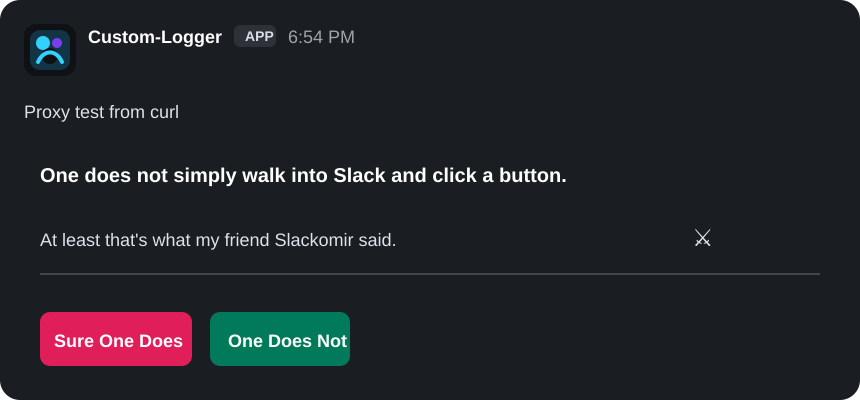

# slack-tracker

Simple Slack logging for Node.js and browser applications using Slack Incoming Webhooks.

`slack-tracker` sends formatted logs, block messages, and raw Slack payloads to a Slack channel. Server-side code sends directly to Slack. Browser code sends to your own backend proxy route so your Slack webhook URL stays private.

## Features

- Node.js and browser support
- TypeScript declarations included
- Slack Incoming Webhook support
- Direct server-side Slack delivery
- Browser-safe proxy delivery
- Simple log levels with Slack colors
- Raw Slack Block Kit payload support
- Build-before-publish workflow with only `dist` exposed in the npm package

## Installation

```bash
npm install slack-tracker
```

```bash
yarn add slack-tracker
```

```bash
pnpm add slack-tracker
```

## Demo

Video walkthrough: [Watch on YouTube](https://youtu.be/sa4l459zQhY) (3:41 narrated tour of this README)

Live demo:

```txt
https://stackblitz.com/edit/stackblitz-starters-5gwmyjxy?file=index.js
```

#### Download code from stackblitz
```bash
cd demo
npm start
```

Open:

```txt
http://localhost:3030
```

Paste a webhook URL into the demo page and click `Save`, or start the demo with `SLACK_WEBHOOK_URL` set in your environment (see `demo/.env.example`).


## Configuration

Call `slackLogConfig()` once when your app starts, such as in onload, oninit, bootloader, module loader, app constructor, or server startup code.

```ts
import { slackLogConfig } from "slack-tracker";

slackLogConfig({
  webhookUrl: "https://hooks.slack.com/services/XXX/YYY/ZZZ",
  enable: true,
});
```

Config options:

- `webhookUrl`: Slack Incoming Webhook URL. Required on the server.
- `enable`: Set `false` to disable Slack logs.
- `proxy_url`: Optional browser proxy route.

If `slackLogConfig()` is not called before logging, the package prints a console error and skips the log.

Type:

```ts
slackLogConfig({
  webhookUrl?: string,
  enable?: boolean,
  proxy_url?: string,
});
```

## Basic Usage

```js
const { LogLevel, slack, slackLogConfig } = require("slack-tracker");

slackLogConfig({
  webhookUrl: "https://hooks.slack.com/services/XXX/YYY/ZZZ",
  enable: true,
});

await slack.log("Server started", { port: 3000 }, LogLevel.SUCCESS);
await slack.log("User created", { id: 101, email: "user@example.com" });
await slack.log("Validation warning", { field: "email" }, LogLevel.WARN);
await slack.log(
  "Unhandled error",
  { message: "Something failed" },
  LogLevel.ERROR,
);
```

```ts
import { LogLevel, slack, slackLogConfig } from "slack-tracker";

slackLogConfig({
  webhookUrl: "https://hooks.slack.com/services/XXX/YYY/ZZZ",
  enable: true,
});

await slack.log(
  "Payment received",
  { amount: 49, currency: "USD" },
  LogLevel.INFO,
);
```

`data` can be any value, such as an object, an array, or a string:

```ts
await slack.log("Data", [{ title: "1yes!" }]);
await slack.log("Data", { title: "2yes!" });
await slack.log("Data", "Hello world!");
```

## Log Levels

```ts
LogLevel.DEFAULT;
LogLevel.SUCCESS;
LogLevel.INFO;
LogLevel.WARN;
LogLevel.ERROR;
```

Each level adds a label, icon, and color to the Slack message.

## Block Message Usage

Use `logBlockMessage` when you want to send multiple titled values.

```ts
import { LogLevel, slack } from "slack-tracker";

await slack.logBlockMessage(
  "Order created",
  [
    { title: "Order ID", value: "ORD-1001" },
    { title: "Amount", value: 129.99 },
    { title: "Customer", value: { id: 12, name: "Jane Doe" } },
  ],
  LogLevel.SUCCESS,
);
```

## Raw Slack Payload

Use `raw` when you need full control over the Slack payload.

```ts
import { slack } from "slack-tracker";

await slack.raw({
  text: "Deployment completed",
  blocks: [
    {
      type: "section",
      text: {
        type: "mrkdwn",
        text: "*Deployment completed successfully*",
      },
    },
    {
      type: "context",
      elements: [
        {
          type: "mrkdwn",
          text: "Environment: production",
        },
      ],
    },
  ],
});
```

### Button example



```ts
await slack.raw({
  text: "One does not simply walk into Slack and click a button.",
  blocks: [
    {
      type: "section",
      text: {
        type: "mrkdwn",
        text: "*One does not simply walk into Slack and click a button.*",
      },
    },
    {
      type: "section",
      text: {
        type: "mrkdwn",
        text: "At least that's what my friend *Slackomir* said. :crossed_swords:",
      },
    },
    {
      type: "divider",
    },
    {
      type: "actions",
      elements: [
        {
          type: "button",
          text: {
            type: "plain_text",
            text: "Sure One Does",
            emoji: true,
          },
          style: "danger",
          value: "sure_one_does",
          action_id: "sure_one_does",
        },
        {
          type: "button",
          text: {
            type: "plain_text",
            text: "One Does Not",
            emoji: true,
          },
          style: "primary",
          value: "one_does_not",
          action_id: "one_does_not",
        },
      ],
    },
  ],
});
```

If you want button clicks to do something, enable Slack app interactivity and handle the `block_actions` payload for each `action_id`.

## Browser Usage

Browser usage is supported. The browser build does not send requests directly to Slack. It posts log requests to your backend proxy route.

```ts
import { LogLevel, slack, slackLogConfig } from "slack-tracker";

slackLogConfig({
  enable: true,
});

await slack.log("Button clicked", { page: "/pricing" }, LogLevel.INFO);
```

The browser request is sent to:

```txt
/api/slack-tracker
```

Do not put your Slack webhook URL in browser config. Use only `enable` and `proxy_url` in the browser. Configure `webhookUrl` only in the server/proxy runtime.

Set `proxy_url` only when your proxy route is different.

```ts
slackLogConfig({
  enable: true,
  proxy_url: "/api/logs/slack",
});
```

## Next.js Proxy Route

Create `app/api/slack-tracker/route.ts`:

```ts
import { handleSlackLogsRequest, slackLogConfig } from "slack-tracker";

slackLogConfig({
  webhookUrl: process.env.SLACK_WEBHOOK_URL,
  enable: true,
});

export async function POST(request: Request) {
  const body = await request.json();
  const result = await handleSlackLogsRequest(body);

  return Response.json(
    {
      success: result.success,
      message: result.message,
    },
    {
      status: result.status,
    },
  );
}
```

## Express Proxy Route

```js
const express = require("express");
const { handleSlackLogsRequest, slackLogConfig } = require("slack-tracker");

const app = express();

slackLogConfig({
  webhookUrl: process.env.SLACK_WEBHOOK_URL,
  enable: true,
});

app.use(express.json());

app.post("/api/slack-tracker", async (req, res) => {
  const result = await handleSlackLogsRequest(req.body);

  res.status(result.status).json({
    success: result.success,
    message: result.message,
  });
});
```

## API

### `slack.log(label, data, errorType?)`

Sends a formatted Slack log message.

```ts
slack.log("Label", { any: "value" }, LogLevel.INFO);
```

### `slack.logBlockMessage(label, objectData, errorType?)`

Sends a Slack message with titled fields.

```ts
slack.logBlockMessage("Label", [{ title: "Status", value: "OK" }]);
```

### `slack.raw(payload)`

Sends a custom Slack webhook payload as-is.

```ts
slack.raw({ text: "Hello Slack" });
```

### `handleSlackLogsRequest(body)`

Handles browser proxy requests and sends them to Slack from your server.

```ts
const result = await handleSlackLogsRequest(body);
```

### `slackLogConfig(config)`

Stores Slack config once for later log calls.

```ts
slackLogConfig({
  webhookUrl: "https://hooks.slack.com/services/XXX/YYY/ZZZ",
  enable: true,
});
```

Call this before `slack.log`, `slack.logBlockMessage`, `slack.raw`, or `handleSlackLogsRequest`.

### Exports

- `slack`
- `slackLogConfig`
- `handleSlackLogsRequest`
- `LogLevel`
- `LogColor`
- `DEFAULT_PROXY_URL` (`"/api/slack-tracker"`)
